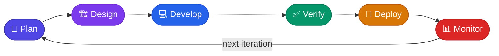
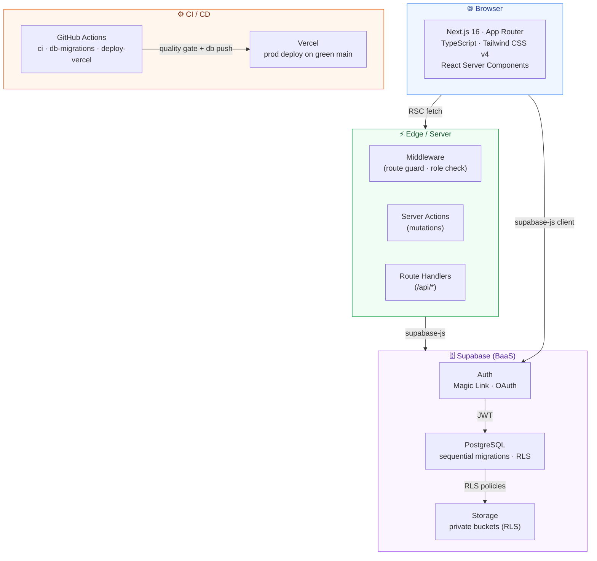
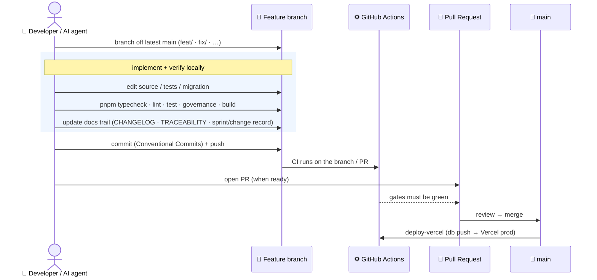
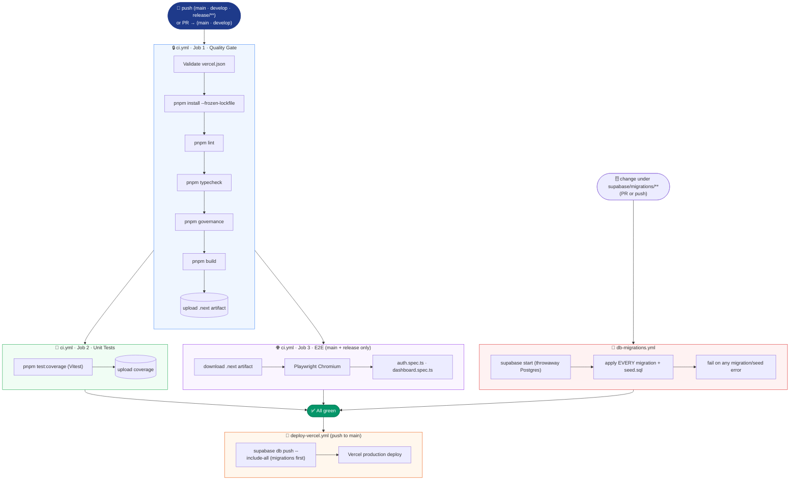
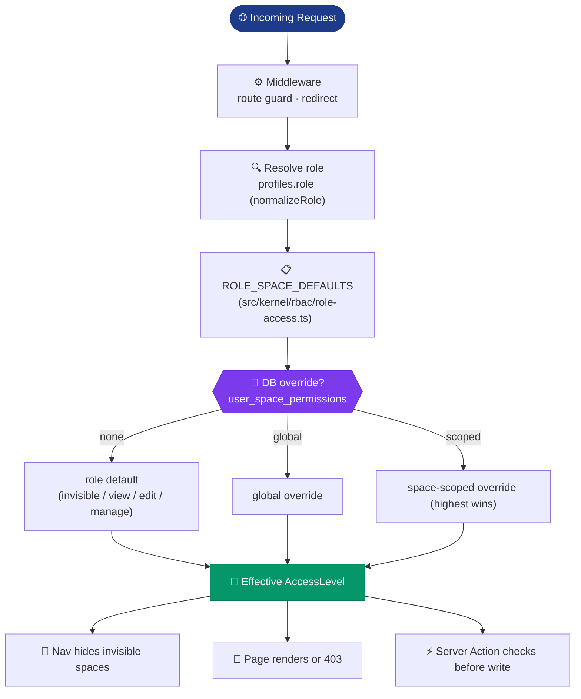

# Software Development Lifecycle — Inspire2Live Platform

> **How to view this document:** Open it in VS Code and press `Ctrl+Shift+V` to see all Mermaid diagrams rendered.
> On GitHub the diagrams render automatically in the browser.
>
> For the short, everyday brief (commands, guardrails, workflow, how to document work),
> see [`../AGENTS.md`](../AGENTS.md). This document is the deeper lifecycle reference it
> points into; where the two overlap, AGENTS.md and the code are the source of truth.

---

## Overview

This document describes the Software Development Lifecycle (SDLC) as implemented in the
Inspire2Live Platform. The process is a **PR-based, sprint-cadenced, continuously-deployed**
model: work happens on short-lived branches, merges to `main` through pull requests that
must pass automated gates, and deploys to Vercel + Supabase on every green `main` merge.

The codebase is organised as a **kernel + independent components** (ADR-0009); the workflow
below applies uniformly across all of them. The direct-to-`main` "pure trunk-based" model
described in ADR-0005 has been **superseded by [ADR-0011](ADR/0011-pr-based-trunk-with-sprints.md)**.

---

## 1 · High-Level Lifecycle

The lifecycle is a continuous loop of six phases. Every line of production code can be
traced from a requirement through design, implementation, verification, deployment, and back
to planning.



| Phase | Owner | Key Artefacts |
|-------|-------|---------------|
| 🎯 Plan | PM / Stakeholder | `sprints/`, `MVP_SCOPE_AND_ROADMAP.md`, `PLATFORM_CONCEPT_UPDATE_v1.md` |
| 🏗️ Design | Architect | ADR, `TRACEABILITY.md`, component `manifest.ts`, migration spec |
| 💻 Develop | Contributor + AI assistant | Source in `src/modules/*` / `src/kernel/*`, unit tests, Supabase migration |
| ✅ Verify | GitHub Actions | CI — lint · typecheck · governance · build · unit · E2E · DB-migration validation |
| 🚀 Deploy | GitHub Actions + Vercel + Supabase | `supabase db push` (migrations) then Vercel production deploy |
| 📊 Monitor | Developer / PM | `MONITORING.md`, `INCIDENT_RESPONSE.md`, `CHANGELOG.md`, `docs/changes/` |

---

## 2 · Technology Stack



Full tooling table in [§9](#9--tooling-reference). Framework/library versions are pinned in
`package.json`; treat it as the source of truth rather than this diagram.

---

## 3 · Development Workflow (PR-based, sprint cadence)

Most implementation is done by **AI coding agents**, with a human reviewing and approving;
the workflow and the quality gates are identical regardless of who writes the code. Work is
scoped either to a **sprint** (`sprints/sprint-NN/`) or, for standalone work, tracked as a
**Change Record** (`docs/changes/`) — see [`../AGENTS.md`](../AGENTS.md) §8.



The historical Cline/PowerShell git protocol that this section used to describe is retained
only as a record in [`CLINE_WORKFLOW.md`](CLINE_WORKFLOW.md); it no longer governs the workflow.

---

## 4 · Continuous Integration & Deployment

Three GitHub Actions workflows run in `.github/workflows/`.



- **`ci.yml`** — Quality Gate (lint · typecheck · **governance** · build), Unit Tests
  (`pnpm test:coverage`), and E2E smoke (only on `main` / `release/**`). Runs on pushes to
  `main`/`develop`/`release/**` and on PRs to `main`/`develop`.
- **`db-migrations.yml`** — spins up a throwaway Supabase stack and applies **every**
  migration + `seed.sql`, so a broken or mis-numbered migration fails at PR time, not on
  the production `db push`. Runs when `supabase/migrations/**`, `seed.sql`, or `config.toml`
  change.
- **`deploy-vercel.yml`** — on push to `main`, runs `supabase db push` (applies new
  migrations to the remote DB) **then** deploys the app to Vercel production. Idempotent —
  only new migrations are applied.

### Environment matrix

| Environment | Trigger | DB | E2E |
|-------------|---------|----|-----|
| Local dev | `pnpm dev` | local or remote Supabase | manual |
| CI (PR) | PR to `main`/`develop` | throwaway Postgres for migration validation | ❌ |
| Vercel Preview | branch push | production Supabase | ❌ |
| Vercel Production | `main` merge | production Supabase (`db push` first) | ✅ |

---

## 5 · Database Migration Lifecycle

The PostgreSQL schema evolves through **sequential, numbered migrations** in
`supabase/migrations/` (the directory is the authoritative history — do not hardcode a count
here). Migrations are never edited after merge; schema changes always add a new file.

### Migration rules

- **Never modify** a committed migration — add a new one instead.
- **File name** `NNNNN_snake_case.sql`, numbered **uniquely and above the highest number on
  `main`**. A duplicate version fails the `db-migrations` gate (the CI checks out the PR
  *merge* ref, so a number that `main` also used collides). Rebase + renumber to fix.
- **Idempotent / re-runnable** — guard with `if not exists`, `on conflict`, `drop … if
  exists`, etc.
- **Declare new tables in an owning `manifest.ts`** (`src/modules/<c>/manifest.ts` or the
  kernel) so the table-ownership governance check accounts for them (ADR-0009).
- **After DDL**: regenerate `src/types/database.ts` (`supabase gen types`), rely on the
  migration's `notify pgrst, 'reload schema';`, and add an `error.tsx` next to any new
  DB-querying page (see `IMPLEMENTATION_GUIDE.md` → Defensive data access).
- **Seed data** lives in `supabase/seed.sql` (dev) and `supabase/seed-demo.sql` (demo).

Application to production is automated by `deploy-vercel.yml` (`supabase db push`) on merge
to `main`.

---

## 6 · Permission & Role Access Model

The platform resolves access from **role defaults + per-user, per-space database overrides**,
with the highest applicable level winning.



- **Roles** are defined in `src/kernel/rbac/platform-roles.ts` (canonical values include
  `PatientAdvocate`, `Researcher`, `Comms`, `HubCoordinator`, `IndustryPartner`,
  `BoardMember`, `PlatformAdmin`, `Superadmin`; legacy DB values are normalised). A
  `comms_team` capability gates the Communications Workspace.
- **Spaces + the default matrix** live in `role-access.ts` / `permissions.ts`. Because these
  evolve, treat the code and [`ROLE_PERMISSION_MODEL.md`](ROLE_PERMISSION_MODEL.md) as the
  authoritative source rather than a table here.
- **Enforcement is in the database (RLS)**, not only the UI — see ADR-0004 and
  [`SECURITY_AND_PRIVACY.md`](SECURITY_AND_PRIVACY.md).

---

## 7 · Branching & Release Strategy

Short-lived branches → PR → `main`. See [ADR-0011](ADR/0011-pr-based-trunk-with-sprints.md).

| Branch pattern | Purpose | CI |
|----------------|---------|----|
| `feat/… · fix/… · ci/… · chore/… · docs/…` | all feature/fix/ops work | Quality + Unit (+ DB-migrations if migrations changed) |
| `main` | production · always deployable | Quality + Unit + E2E → `db push` + deploy |
| `develop` | optional integration branch | Quality + Unit |
| `release/**` | release prep / hotfix | Quality + Unit + E2E |

- Branch off the latest `main`; keep branches small and short-lived.
- Merge via PR once the gates are green (open a PR when the work is ready, not per commit).
- Release/versioning detail → [`RELEASE_PROCESS.md`](RELEASE_PROCESS.md).

---

## 8 · Commit Convention & PR Process

### Commit messages — [Conventional Commits](https://www.conventionalcommits.org)

```
type(scope): short imperative description

Types:  feat · fix · docs · refactor · test · chore · ci
Scope:  the area touched, e.g. conferences · intake · auth · nav · ui · db
```

Examples:
```
feat(conferences): add attending-type-aware operating page
fix(auth): resolve magic-link redirect loop
docs(sdlc): refresh CI and workflow sections
```

### Pull requests

Open a PR only when the change is ready (not for every commit). Fill in the repository PR
template — [`.github/pull_request_template.md`](../.github/pull_request_template.md) — which
covers requirement mapping, ADR/deviation, validation (typecheck · tests · RLS ·
accessibility · traceability), and a **database-changes checklist** (migration added, types
regenerated, defensive `{ data, error }` queries, `error.tsx`, RLS role strings). Follow the
documentation standard in [`../AGENTS.md`](../AGENTS.md) §8.

---

## 9 · Tooling Reference

| Tool | Role | Config |
|------|------|--------|
| **Next.js 16** | Full-stack React (App Router, RSC) | `next.config.ts` |
| **TypeScript** | Type safety | `tsconfig.json` |
| **Tailwind CSS v4** | Styling | `postcss.config.mjs` |
| **Supabase** | Auth · Postgres · Storage | `supabase/config.toml` |
| **pnpm** | Package manager (Node 20, see `.nvmrc`) | `pnpm-workspace.yaml` |
| **Vitest** | Unit tests | `vitest.config.ts` |
| **Playwright** | E2E smoke | `playwright.config.ts` |
| **ESLint** | Static analysis | `eslint.config.mjs` |
| **Governance gates** | Module boundaries · table ownership · reachability | `pnpm governance` (`src/kernel/governance/*`) |
| **GitHub Actions** | CI/CD | `.github/workflows/{ci,db-migrations,deploy-vercel}.yml` |
| **Vercel** | Hosting · Edge CDN | `vercel.json` |

---

## 10 · Cross-Document Index

Start with [`../AGENTS.md`](../AGENTS.md) (quick brief) and [`README.md`](README.md) (full index).

| Document | Content |
|----------|---------|
| [`../AGENTS.md`](../AGENTS.md) | **Canonical brief** — commands, guardrails, workflow, documentation standard |
| [`README.md`](README.md) | Documentation index |
| [`MODULAR_COMPONENT_ARCHITECTURE.md`](MODULAR_COMPONENT_ARCHITECTURE.md) | Kernel + components, manifests, governance (ADR-0009) |
| [`IMPLEMENTATION_GUIDE.md`](IMPLEMENTATION_GUIDE.md) | Coding patterns, Definition of Done, defensive data access |
| [`TEST_STRATEGY.md`](TEST_STRATEGY.md) | Test philosophy, coverage, risk map |
| [`AI_INTEGRATION.md`](AI_INTEGRATION.md) | How the app uses AI (model catalog lives in code) |
| [`ROLE_PERMISSION_MODEL.md`](ROLE_PERMISSION_MODEL.md) | Authoritative role × space matrix |
| [`SECURITY_AND_PRIVACY.md`](SECURITY_AND_PRIVACY.md) | GDPR, data handling, security controls |
| [`TRACEABILITY.md`](TRACEABILITY.md) | Requirement → ADR → code → test mapping |
| [`RELEASE_PROCESS.md`](RELEASE_PROCESS.md) · [`INCIDENT_RESPONSE.md`](INCIDENT_RESPONSE.md) · [`MONITORING.md`](MONITORING.md) | Release, incident, observability |
| [`ADR/`](ADR/) | Architecture Decision Records |
| [`sprints/`](../sprints/README.md) · [`changes/`](changes/) | Delivery records (planned + standalone) |
| [`../CHANGELOG.md`](../CHANGELOG.md) | Release history (semver) |

---

*Last reviewed: 2026-07-17 · Maintainer: Michael Wittinger · Defers to `AGENTS.md` for the quick brief.*
